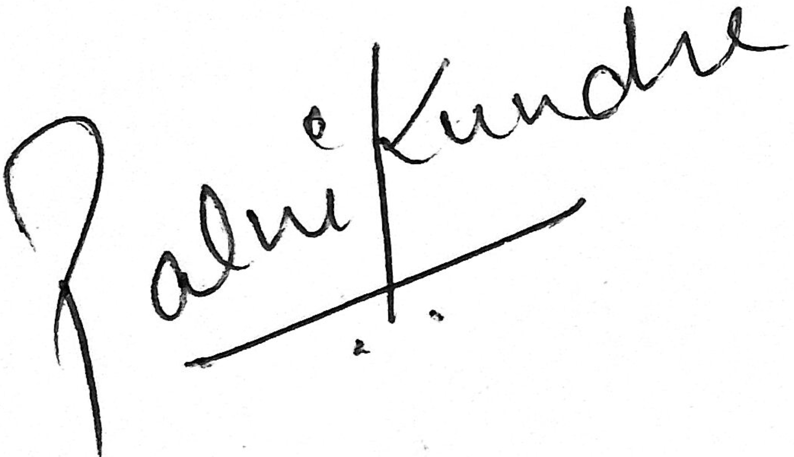

Senior Manager S&T Feed Additives 
ADM, Animal Nutrition Division  Rolle, Vaud 
Switzerland

Dear Hiring Manager,

I am interested in the Research Project Manager (Ruminant) position within the Animal Nutrition division at ADM. With my background in Food science and scientific research, I believe I am an ideal candidate to contribute to your innovative and science-based product development initiatives.

As a recent Ph.D. graduate with a focus on human gut microbiota and its nutrition with dietary supplements (vitamins), I have a deep-seated passion for scientific research and project management. I have recently followed ADM's work closely and am truly impressed by your commitment to advancing livestock nutrition through cutting-edge technology and scientific rigor.

In my doctoral research, I actively investigated microbial interactions driven by the sharing of essential vitamins within the human gut microbiota. Additionally, I explored the crucial role of these vitamins in sustaining the survival and metabolism of beneficial gut microbes, which are often compromised in the context of gut diseases. These research findings are not merely academic; they are passionately directed towards the noble cause of promoting a healthier gut, emphasizing overall gut well-being. This work involved meticulous project management, including literature review, protocol design, statistical analyses, and scientific report generation. Furthermore, I am proficient in scientific communication, having successfully published my research in peer-reviewed journals and presented my work at conferences; thereby, I possess expertise in translating scientific findings for broader audiences. I am eager to bring these skills to ADM to promote your animal nutrition research and contribute to your ongoing success.

My ability to coordinate various project workstreams with internal and external teams makes me well- equipped to drive research projects from conception to product launch. I am excited about the opportunity to establish collaborative relationships within ADM, leverage our internal capabilities, and develop high- level research projects with reliable partners.

I have attached my CV for your review. I kindly request the opportunity to discuss how my expertise can contribute to your research team and support your mission of advancing livestock nutrition. I am enthusiastic about the possibility of joining ADM and contributing to your innovative projects. Thank you for considering my application. I eagerly await your response and the opportunity to discuss my potential contribution to your team further.

Best regards, 
 
Palni Kundra